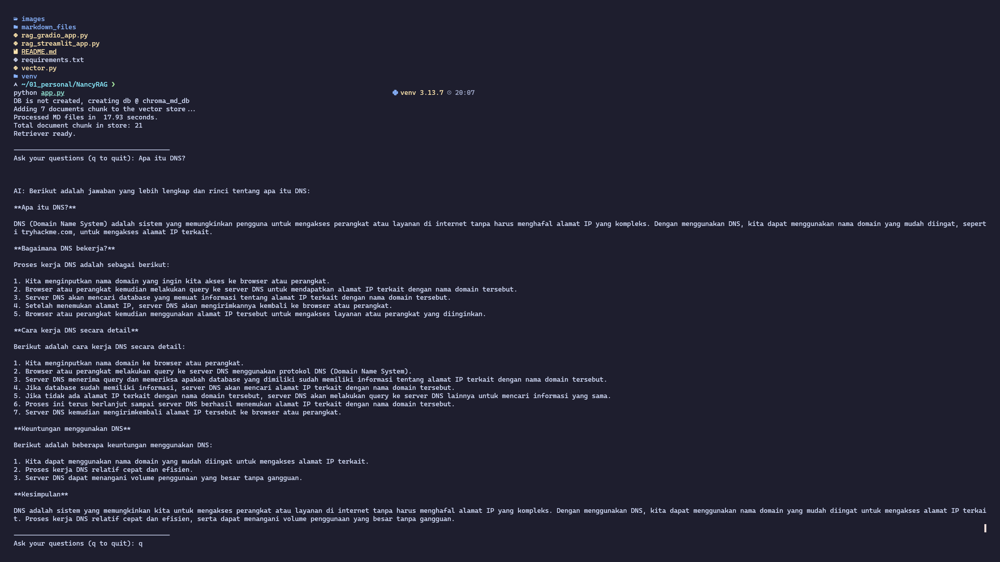
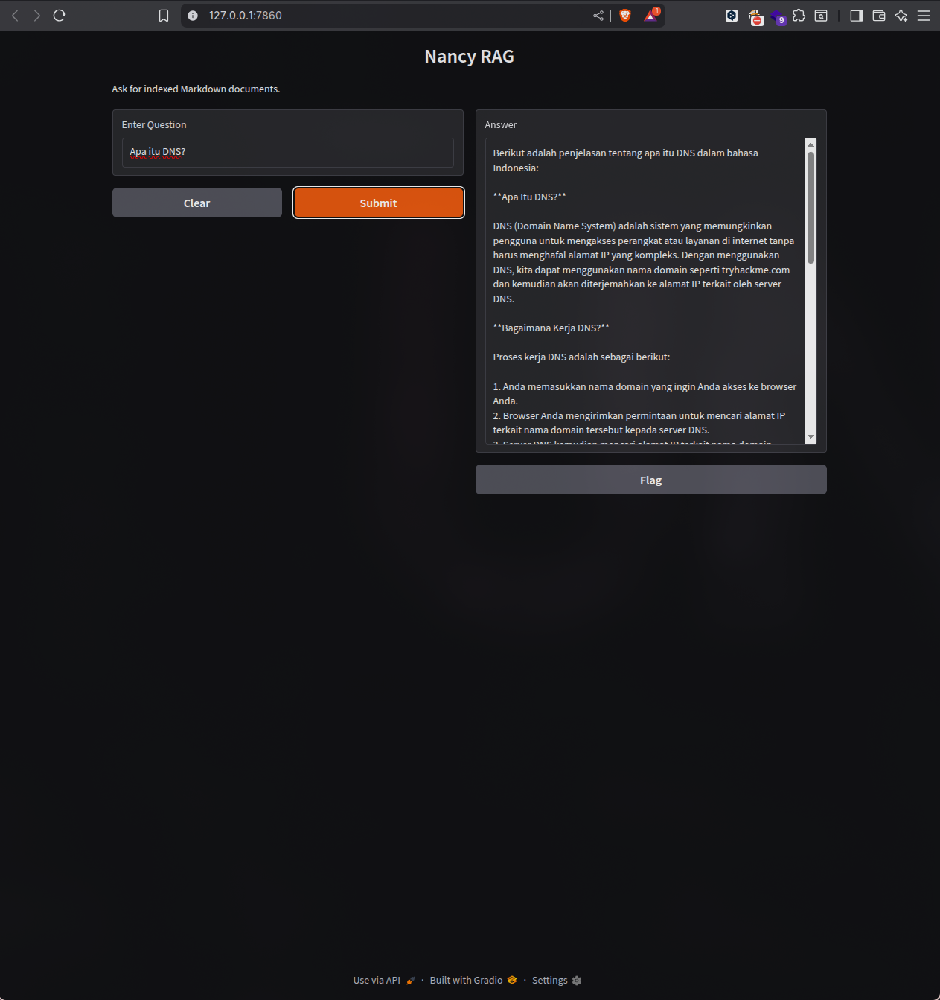
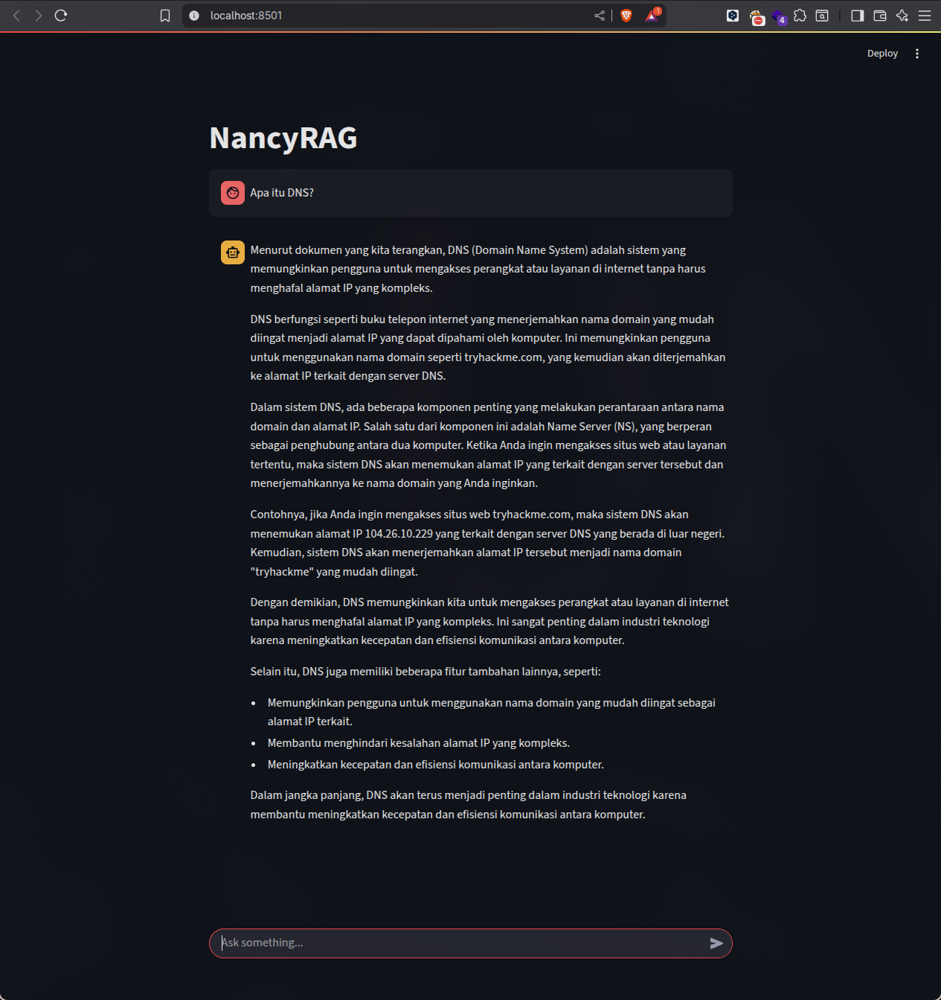

# NancyRAG

[](https://www.python.org/)
[](https://www.langchain.com/)
[](LICENSE)
[](https://ollama.ai)

**NancyRAG** is a **Retrieval Augmented Generation (RAG)** AI project running **LLaMA locally** using [Ollama](https://ollama.ai). It supports both terminal and web interfaces (Gradio and Streamlit) and lets you use any Markdown files as knowledge sources.

---

## Key Features

* Works with **any LLaMA model** served via Ollama (`llama3.2:3b` recommended).
* Supports **lightweight embedding models** like `mxbai-embed-large` (600MB).
* Three interface options:

  * **Terminal** → `app.py`
  * **Web (Gradio)** → `rag_gradio_app.py`
  * **Web (Streamlit)** → `rag_streamlit_app.py`
* `markdown_files/` folder can contain any content (e.g., DNS basics, hashing functions, cybersecurity notes).
* Automatically creates and persists a **Chroma vector database**.

---

## Project Structure

```
NancyRAG/
├── app.py                 # Terminal interface
├── rag_gradio_app.py      # Web interface via Gradio
├── rag_streamlit_app.py   # Web interface via Streamlit
├── vector.py              # Embedding model & retriever configuration
├── requirements.txt       # Dependencies
└── markdown_files/        # Knowledge source folder
```

---

## Installation

1. **Clone the repository**

```bash
git clone https://github.com/username/NancyRAG.git
cd NancyRAG
```

2. **Create a virtual environment**

```bash
python -m venv venv
source venv/bin/activate      # Bash/Zsh
# or
source venv/bin/activate.fish # Fish shell
```

3. **Install dependencies**

```bash
pip install -r requirements.txt
```

4. **Pull Ollama models**

```bash
ollama pull llama3.2:3b
ollama pull mxbai-embed-large
```

---

## Running NancyRAG

* **Terminal interface**

```bash
python app.py
```

* **Web interface (Gradio)**

```bash
python rag_gradio_app.py
```

* **Web interface (Streamlit)**

```bash
streamlit run rag_streamlit_app.py
```

> **Note:** Ensure that the Ollama models are running before starting any app.





---

## Customization

### 1. Change the LLaMA model

In `app.py`, `rag_gradio_app.py`, or `rag_streamlit_app.py`:

```python
model = OllamaLLM(model="llama3.2:3b", base_url=ollama_url)
```

Replace `"llama3.2:3b"` with your preferred LLaMA model name.

### 2. Change the embedding model

In `vector.py`, inside the `md_rag` function:

```python
model_name: str = "mxbai-embed-large"
```

Replace `"mxbai-embed-large"` with any other embedding model available in Ollama.

### 3. Adjust document chunking

Still inside `md_rag`:

```python
chunk_size=1000, chunk_overlap=150
```

* `chunk_size`: number of characters per document segment (larger size = more context but more memory usage).
* `chunk_overlap`: number of overlapping characters between segments (preserves continuity).

### 4. Change retriever search results

At the end of `vector.py`:

```python
return vector_store.as_retriever(search_kwargs={"k": 5})
```

* `k`: number of document chunks retrieved per query (higher = more context but slower responses).

### 5. Change the prompt template

Edit in:

* `app.py`
* `rag_gradio_app.py`
* `rag_streamlit_app.py`

Default:

```python
template = """
You are an expert answering technical questions using the following documents:
{documents}

Question: {question}
Answer in detail, structured, and in Indonesian.
"""
```

* You can change the language or style freely.
* **Keep `{documents}` and `{question}` placeholders intact** — they are dynamically replaced at runtime.

---

## Example Usage

1. Add Markdown files to `markdown_files/` (e.g., `dns_basics.md`, `hash_functions.md`).
2. Run any interface (terminal, Gradio, or Streamlit).
3. Ask questions such as:

```
What is DNS?
```

4. NancyRAG will answer using your Markdown knowledge base.


---

## Dependencies

See `requirements.txt`:

* `langchain`
* `langchain-ollama`
* `langchain-chroma`
* `langchain-community`
* `unstructured[md]`
* `gradio`
* `streamlit`

---

## License

This project is open source — feel free to use, modify, and contribute.
